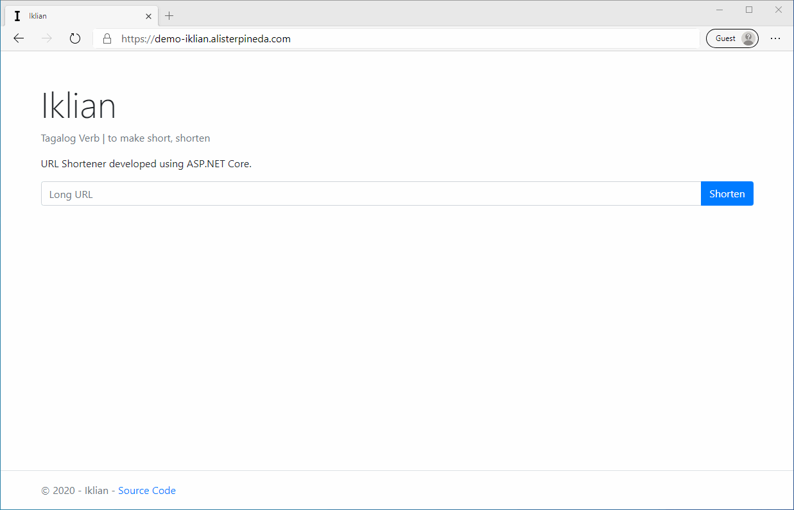

# Iklian

URL Shortener implemented in ASP.NET Core MVC

## Background

URL shorteners, as the name implies, provide a service to convert long, encumbering links to short, easily shareable links. Additionally, they can also be used to measure and analyze internet traffic.

Examples of such services include [bit.ly](https://bitly.com/), [ow.ly](https://hootsuite.com/pages/owly) and goo.gl (discontinued since March 20, 2019).

This project started as a way to personally explore the world of ASP.NET and web development in general to complement my new software development role that started in December 16, 2019.

## Demo
[Website](https://demo-iklian.alisterpineda.com)

*In the real world, it would be counterintuitive to have the FQDN to be as long as the demo link above. It would be more appropriate to use a much shorter one like `bit.ly` or `goo.gl`.*

## Possible Roadmap
- [x] Initial Implementation
- [ ] Admin Page
    - [ ] View list of shortened links
    - [ ] Remove links
- [ ] Traffic Analytics
    - [ ] Core functionality (ex: database changes)
    - [ ] Client-side view
- [ ] Add users system
    - [ ] Self management of links
    - [ ] Access analytics of their own links